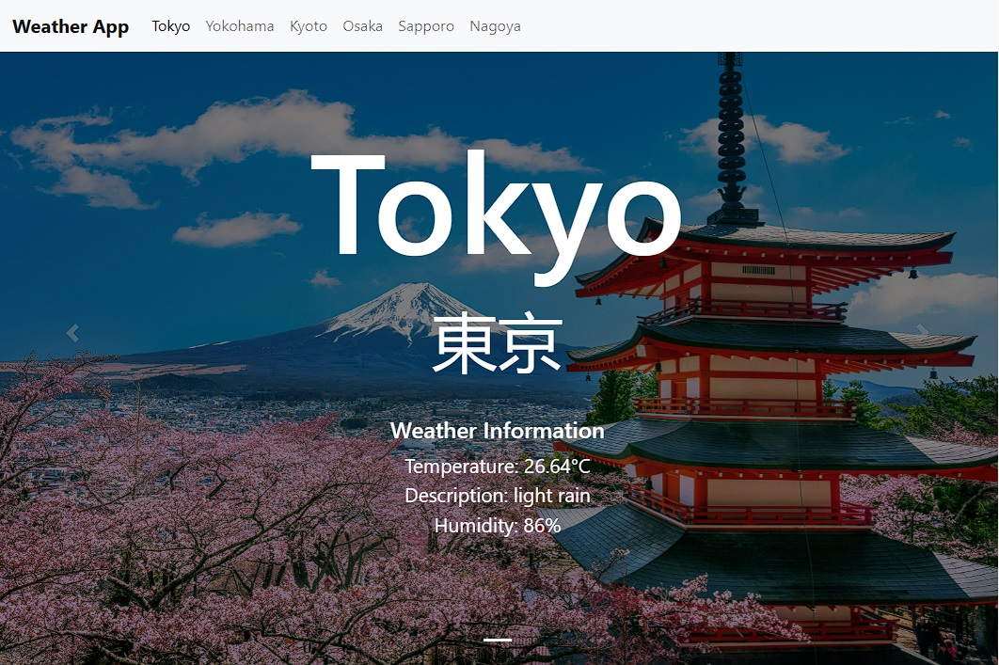

## About the Weather App
Weather App is a web application built using Laravel v10.21.0 (PHP framework) and Vue.js v3.2.36 (JavaScript framework) that allows users to check the current weather forecast for some cities in Japan (OpenWeather API). It also provides suggested accomodations/hotels and tourist spots with the help of Geoapify Places API. Specifically, it aims to provide travel information of Japan for foreign tourists visiting Japan for the first time.

This UI/UX code implementation is the best as it effectively utilizes the reusability of API components. Each of the six cities in Japan utilizes only one component for the Weather, Places (Accommodations), and Tourism (Tourist Spots) APIs, demonstrating the full potential of Vue.js. 

At the home page, we can easily see the weather information, suggested accomodations, and tourist spots with the addresses at a glance. This makes it easy for foreign tourists to get an idea of where they want to go.

## Technologies Used
<ul>
    <li>Laravel version 10.21.0 (PHP)</li>
    <li>Vue.js v3.2.36 (JavaScript)</li>
    <li>HTML and CSS, Bootstrap</li>
    <li>OpenWeather API</li>
    <li>Geoapify API</li>
</ul>

## Screenshots

  

  

## Getting Started
To get started with the Weather App on your local machine, follow these steps:
1. Clone the repository: git clone https://github.com/TheDrei/weather-app.git
2. Navigate to the project directory: cd weather-app
3. Install PHP dependencies: composer install 
4. Install JavaScript dependencies: npm install 
5. Install jQuery plugin: npm install jquery
6. In case an Error 500 shows, try to clear the cache by running: php artisan cache:clear
7. Run the application: npm run dev.
8. Access the App:Open your web browser and go to http://localhost/weather-app/public/ to access the Weather App.

## Image Sources 
Tokyo - <a href="https://www.freepik.com/free-photo/cherry-blossoms-spring-chureito-pagoda-fuji-mountain-japan_10824511.htm#query=tokyo&position=0&from_view=search&track=sph">Image by tawatchai07</a> on Freepik

Yokohama - <a href="https://www.freepik.com/free-photo/yokohama-skyline-city_3983393.htm#query=yokohama&position=0&from_view=search&track=sph">Image by lifeforstock</a> on Freepik

Kyoto - <a href="https://www.freepik.com/free-photo/yasaka-pagoda-sannen-zaka-street-kyoto-japan_10695381.htm#query=kyoto&position=0&from_view=search&track=sph">Image by tawatchai07</a> on Freepik

Osaka - <a href="https://www.freepik.com/free-photo/cherry-blossoms-castle-himeji-japan_10824394.htm#query=osaka&position=1&from_view=search&track=sph">Image by tawatchai07</a> on Freepik

Sapporo - <a href="https://www.freepik.com/free-photo/beautiful-architecture-building-with-mountain-landscape-winter-season-sapporo-city-hokkaido-japan_4097423.htm#query=sapporo&position=0&from_view=search&track=sph">Image by lifeforstock</a> on Freepik

Nagoya - <a href="https://wallpapercave.com/w/wp8846479">Image by hesengyu</a> on WallpaperCave
